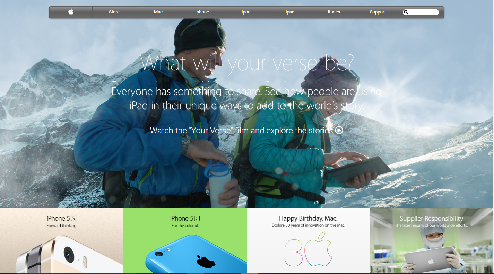

# Building with Backgrounds and Gradients

> The target of this project is to create a clone page based on this [apple's old page](https://web.archive.org/web/20140301004610/http://www.apple.com/)
> using images as backgrounds and gradients.

You can find the original description in [The Odin Project](https://www.theodinproject.com/courses/html5-and-css3/lessons/building-with-backgrounds-and-gradients)

## Built With

- HTML, CSS3

## Live Demo

[Live Demo Link](https://rawcdn.githack.com/oscardelalanza/building-with-gradients/3b4578da26bfd1e4a5cbead26166972b94a75505/index.html)

## Getting Started

> To get a local copy up and running follow these simple example steps.

### Prerequisites

- `Git`

### Setup

To clone the project into your local environment do the following.

- Open a new `terminal` window and navigate to the directory where the project will be stored.
- Run the command `git clone git@github.com:oscardelalanza/building-with-gradients.git`.
- Run the command `cd building-with-gradients` to enter to the project directory.

### Install

- This project doesn't require installation, node modules, or similar.

### Usage

*This project is a web template. Is only demonstrative and does not contain functional features.*

- Open `index.html` in your web browser to see the page.

### Deployment

- Open `index.html` file to go directly to the page, or use your preferred web server.

## Authors

👤 **Oscar De La Lanza**

- Github: [@oscardelalanza](https://github.com/oscardelalanza)
- Twitter: [@oscardelalanza](https://twitter.com/oscardelalanza)
- Linkedin: [Oscar De La Lanza](https://linkedin.com/in/oscardelalanza)
- Email: oscardelalanza@gmail.com

## 🤝 Contributing

Contributions, issues and feature requests are welcome!

## Show your support

Give a ⭐️ if you like this project!
